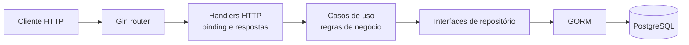

# MedaIO

MedaIO é uma API REST em Go para gerenciamento de conteúdo de um blog. O projeto reúne usuários, autenticação, publicações, tags e comentários em uma aplicação com persistência em PostgreSQL, documentação OpenAPI e execução local via Docker Compose.

O repositório ainda utiliza `Gblog` como nome do módulo Go e em alguns identificadores internos. Esses nomes não são renomeados: **MedaIO** é o nome oficial usado na apresentação do projeto.

## Visão geral

A API atende o ciclo principal de publicação de conteúdo:

- usuários podem se cadastrar, autenticar e gerenciar o próprio perfil;
- autores podem criar rascunhos, editar e publicar posts;
- posts podem ser associados a tags e receber comentários;
- leitores podem consultar posts publicados, autores, tags e comentários;
- endpoints protegidos usam tokens JWT e a aplicação mantém regras de propriedade para operações de edição e exclusão.

A organização do código separa transporte HTTP, casos de uso, persistência e infraestrutura. Os módulos de domínio ficam em `internal/`, cada um com suas entidades, DTOs, repositórios, casos de uso e handlers. Essa estrutura é inspirada em Clean Architecture, mas foi mantida como uma arquitetura modular e pragmática, sem afirmar uma separação purista de todas as dependências.

## Funcionalidades

- Cadastro e consulta pública de usuários.
- Login com email e senha, usando bcrypt para armazenamento e verificação de senhas.
- Geração e validação de JWT com expiração de 24 horas.
- Proteção de rotas com `Authorization: Bearer <token>`.
- Criação de posts inicialmente como `draft`.
- Edição de posts ativos pelo proprietário do recurso.
- Publicação de posts com conteúdo mínimo de 10 caracteres.
- Exclusão lógica de posts, com `IsActive = false` e suporte ao soft delete do GORM.
- Tags com relacionamento many-to-many e comportamento find-or-create por nome.
- Criação, listagem e exclusão de comentários pelo autor.
- Renderização do conteúdo Markdown para HTML usando Goldmark nas respostas de posts.
- Paginação de posts publicados com `limit` entre 1 e 100 e `offset` não negativo.
- Validação de dados de entrada, incluindo email, senha, título, conteúdo e quantidade de tags.
- Health check em `GET /health`.

## Tecnologias

| Finalidade | Tecnologia |
| --- | --- |
| Linguagem | Go 1.26.3 |
| HTTP | Gin v1.12.0 |
| Persistência | PostgreSQL com GORM v1.31.1 e `gorm.io/driver/postgres` |
| Autenticação | `golang-jwt/jwt/v5` com assinatura HS256 |
| Hash de senhas | `golang.org/x/crypto/bcrypt` |
| Markdown | `yuin/goldmark` |
| Documentação | `swaggo/swag` e `gin-swagger` |
| Configuração | `godotenv` e variáveis de ambiente |
| Containerização | Docker e Docker Compose |
| Integração contínua | GitHub Actions, Go vet, golangci-lint, testes e build |

## Arquitetura

Uma requisição percorre as camadas abaixo:



### Responsabilidades

- **Handlers HTTP:** recebem requisições Gin, fazem binding dos JSONs, obtêm o usuário autenticado do contexto e traduzem resultados para respostas HTTP.
- **DTOs:** definem os formatos de entrada e saída dos casos de uso, evitando expor diretamente campos internos das entidades.
- **Casos de uso:** concentram validações e regras como status inicial de posts, conteúdo mínimo para publicação, limites de tags e verificações de propriedade.
- **Repositórios:** expõem contratos por domínio e encapsulam consultas e alterações realizadas com GORM.
- **Entidades:** representam usuários, posts, tags e comentários, incluindo os campos persistidos e relacionamentos.
- **Infraestrutura:** carrega o ambiente, conecta ao PostgreSQL, executa auto-migrate fora de `ENV=production`, valida JWT, aplica CORS e limita requisições.

### Estrutura de diretórios

```text
MedaIO/
├── cmd/
│   ├── main.go                 # Composição da aplicação e registro de rotas
│   └── docs/                   # Swagger gerado
├── internal/
│   ├── blogPost/               # Posts, publicação e tags relacionadas
│   ├── comment/                # Comentários por post
│   ├── tag/                    # Criação e listagem de tags
│   ├── user/                   # Usuários, login e perfil
│   └── infra/                  # Banco, JWT, CORS e rate limiting
├── pkg/blogstatus/             # Status compartilhado: draft, published, archived
├── Dockerfile                  # Build multi-stage da API
├── docker-compose.yml          # API e PostgreSQL para desenvolvimento local
├── go.mod                      # Módulo e dependências Go
└── .github/workflows/ci.yml   # Verificações automatizadas
```

## API

Base URL local: `http://localhost:8080/api/v1`

### Autenticação

| Método | Rota | Responsabilidade | Auth |
| --- | --- | --- | --- |
| `POST` | `/auth/token` | Autenticar com email e senha e emitir JWT | Não |

O token deve ser enviado nas rotas protegidas como `Authorization: Bearer <token>`. O segredo usado para assinar e validar tokens vem de `JWT_SECRET`.

### Usuários

| Método | Rota | Responsabilidade | Auth |
| --- | --- | --- | --- |
| `POST` | `/users` | Criar usuário | Não |
| `GET` | `/users/:id` | Consultar dados públicos do usuário | Não |
| `PUT` | `/users/:id` | Atualizar nome e/ou email | Sim |
| `DELETE` | `/users/:id` | Desativar usuário | Sim |

### Posts

| Método | Rota | Responsabilidade | Auth |
| --- | --- | --- | --- |
| `GET` | `/posts?limit=&offset=` | Listar posts publicados com paginação | Não |
| `GET` | `/posts/slug/:slug` | Consultar um post publicado pelo slug | Não |
| `POST` | `/posts` | Criar post como rascunho | Sim |
| `PUT` | `/posts/:id` | Editar post ativo; exige propriedade | Sim |
| `PATCH` | `/posts/:id/publish` | Publicar post elegível | Sim |
| `DELETE` | `/posts/:id` | Excluir logicamente; exige propriedade | Sim |

`limit` usa 10 como padrão, aceita no máximo 100 e é ajustado para 1 quando informado abaixo desse valor. `offset` usa 0 como padrão e não pode ser negativo.

### Tags

| Método | Rota | Responsabilidade | Auth |
| --- | --- | --- | --- |
| `GET` | `/tags` | Listar tags cadastradas | Não |
| `POST` | `/tags` | Criar ou reutilizar tag pelo nome | Sim |

### Comentários

| Método | Rota | Responsabilidade | Auth |
| --- | --- | --- | --- |
| `GET` | `/posts/:id/comments` | Listar comentários ativos de um post | Não |
| `POST` | `/posts/:id/comments` | Criar comentário em um post existente | Sim |
| `DELETE` | `/comments/:id` | Excluir comentário; exige propriedade | Sim |

### Swagger

Com a aplicação em execução, acesse a interface Swagger em:

```text
http://localhost:8080/swagger/index.html
```

Os arquivos gerados também estão em `cmd/docs/`. Depois de alterar anotações, a documentação pode ser regenerada com `swag init -g cmd/main.go -o cmd/docs` se o [Swag CLI](https://github.com/swaggo/swag) estiver instalado.

## Execução local

### Clonar o projeto

```bash
git clone https://github.com/p-v-dev/MedaIO.git
cd MedaIO
```

### Pré-requisitos

- Go 1.26.3 ou superior compatível com o módulo.
- PostgreSQL, caso a aplicação seja executada sem Docker.
- Docker e Docker Compose, caso seja usada a execução containerizada.
- Swag CLI apenas para regenerar a documentação Swagger.

### Variáveis de ambiente

Crie um arquivo `.env` na raiz do projeto. A aplicação aceita uma URL completa em `DATABASE_URL` ou as variáveis de conexão separadas:

| Variável | Obrigatória | Descrição |
| --- | --- | --- |
| `API_PORT` | Sim | Porta HTTP da API, por exemplo `8080` |
| `JWT_SECRET` | Sim | Segredo usado para assinar tokens JWT |
| `DATABASE_URL` | Alternativa | DSN completo do PostgreSQL |
| `DB_HOST` | Se não usar DSN | Host do PostgreSQL |
| `DB_USER` | Se não usar DSN | Usuário do PostgreSQL |
| `DB_PASSWORD` | Se não usar DSN | Senha do PostgreSQL |
| `DB_NAME` | Se não usar DSN | Nome do banco |
| `DB_PORT` | Se não usar DSN | Porta do PostgreSQL |
| `DB_SSLMODE` | Não | Modo SSL; padrão `disable` |
| `DB_TZ` | Não | Fuso horário; padrão `UTC` |
| `CORS_ORIGINS` | Não | Origem permitida; padrão `*` |
| `ENV` | Não | Quando igual a `production`, desativa o auto-migrate |

Exemplo mínimo para execução local com PostgreSQL no host:

```dotenv
API_PORT=8080
DB_HOST=localhost
DB_USER=gblog
DB_PASSWORD=gblog
DB_NAME=gblog
DB_PORT=5432
JWT_SECRET=change-this-secret
```

### Com Docker Compose

O Compose inicia PostgreSQL 16 e a API. Os valores padrão do banco são `gblog` para usuário, senha e nome, mas `JWT_SECRET` precisa ser informado:

```bash
JWT_SECRET=change-this-secret docker compose up --build
```

No PowerShell:

```powershell
$env:JWT_SECRET = "change-this-secret"
docker compose up --build
```

Depois, a API estará em `http://localhost:8080` e o health check estará disponível em `http://localhost:8080/health`.

### Sem Docker

Instale e inicie o PostgreSQL, configure o `.env` com os dados da conexão e execute:

```bash
go mod download
go run cmd/main.go
```

Para verificar o projeto localmente:

```bash
go test ./...
go vet ./...
go build ./...
```

## Infraestrutura e qualidade

- **Docker:** o `Dockerfile` usa um build multi-stage, gera a documentação Swagger durante a imagem de build e executa a API em uma imagem Alpine com usuário não-root.
- **Docker Compose:** orquestra a API e PostgreSQL 16, com volume persistente e health check para o banco.
- **GitHub Actions:** o workflow `CI` executa em pushes para `main`, baixa dependências, roda `go vet ./...`, golangci-lint, `go test ./... -count=1` e `go build ./...`.
- **Testes:** existe teste unitário para as regras do caso de uso de publicação de posts. O pipeline executa a suíte disponível, mas o projeto não declara uma métrica de cobertura.
- **Entrega contínua:** não há evidência de deploy automatizado neste repositório. O workflow atual é de integração contínua e validação do código.

## Estado atual e próximos passos

As funcionalidades principais de usuários, autenticação, posts, tags, comentários, Markdown, Docker e CI estão implementadas. Permanecem no roadmap:

- upload de imagens e GIFs;
- configuração de Nginx como reverse proxy.

Esses itens são planos futuros, não funcionalidades disponíveis na versão atual.

## Licença

O README original identifica o projeto como MIT. Não há um arquivo `LICENSE` versionado no repositório atual.
